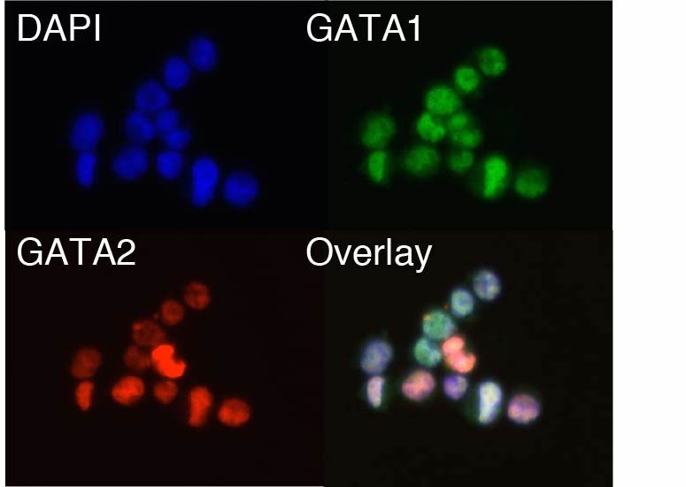



Motivation
----------

The human body is comprised of a large collection of diverse cell types,
each providing a specialized and context-specific function. The advent of high-throughput
single-cell transcriptomics, has enabled unbiased categorization of diverse developmental
and diseased cellular trajectories. However, with current genome-wide approaches,
little can be done to understand: i) how cells vary through time, ii) how this variance
effects cellular decisions and iii) how TFs affect the activity of regulatory elements
(trans) and, in turn, how these elements lead to functional expression differences (cis).
Our lab seeks to address these challenges by developing the next-generation of biological
tools, tools that integrate molecular biology, microscopy and large-scale bioinformatics
to provide a systems-level understanding of single-cells.

Research Interests
------------------

<h3> Developing new ‘-omic’ technologies </h3>

Our group employs a mix set of skills relating to molecular biology, device engineering and microscopy.
We use these skills to leverage sequencing technologies to make high-throughput measurements that seek to
better understand gene regulation within living systems. For example, in previous work, we have developed
<a href="http://www.nature.com/nbt/journal/v32/n6/abs/nbt.2880.html" target="_blank">RNA-MaP</a> and
Assay for Transpose Accessible Chromatin (<a href="http://www.nature.com/nmeth/journal/v10/n12/abs/nmeth.2688.html" target="_blank">ATAC-seq</a>).
Notably, ATAC-seq has become an increasingly popular method to measure genome-wide chromatin accessibility, i.e. the epigenome.
Recently, we have also adapted this method to profile the epigenomes of single-cells
(<a href="http://www.nature.com/nature/journal/v523/n7561/full/nature14590.html" target="_blank">scATAC-seq</a>).
We are actively developing technological tools for improving the quality and throughput of these measurements,
as well as integrating scATAC-seq with other single-cell ‘-omic’ measurements.  

<h3> Advanced computation for inferring ‘causative’ gene networks </h3>

 
With the development of novel technologies comes the possibility of new discoveries and subsequently
the need for new computational tools. We develop computational solutions to support these novel technologies.
Notable examples include methods for high-content
<a href="http://www.nature.com/nbt/journal/v32/n6/abs/nbt.2880.html" target="_blank">image-analysis</a>,
<a href="http://genome.cshlp.org/content/early/2015/08/27/gr.192294.115" target="_blank">nucleosome calling</a>
and <a href="http://biorxiv.org/content/early/2017/02/21/110346" target="_blank">single-cell epigenomics</a>.
Now, we look to build new computational methods that focus on integrating ensemble and single-cell ‘-omics’ data to infer causative
gene networks. Such networks will seek to model governing cis and trans effectors of dynamic cell function.  

<h3> Application to dynamic biological systems </h3>

These efforts coalesce into our studies of dynamic cellular systems. While we have a broad interest
in  human development and disease, we currently focus on <a href="http://www.nature.com/ng/journal/v48/n10/full/ng.3646.html" target="_blank">leukemia</a> and early
<a href="http://biorxiv.org/content/early/2017/02/21/109843.1" target="_blank">human hematopoiesis</a>,
however, our efforts are largely collaborative and we welcome new endeavors. In previous work, we have used some
of the experimental and computational methods described above to both understand molecular effectors that govern
hematopoietic cell fate and in addition we use these findings to better understand the ontogeny of the human cancer,
Acute Myeloid Leukemia (AML).  
