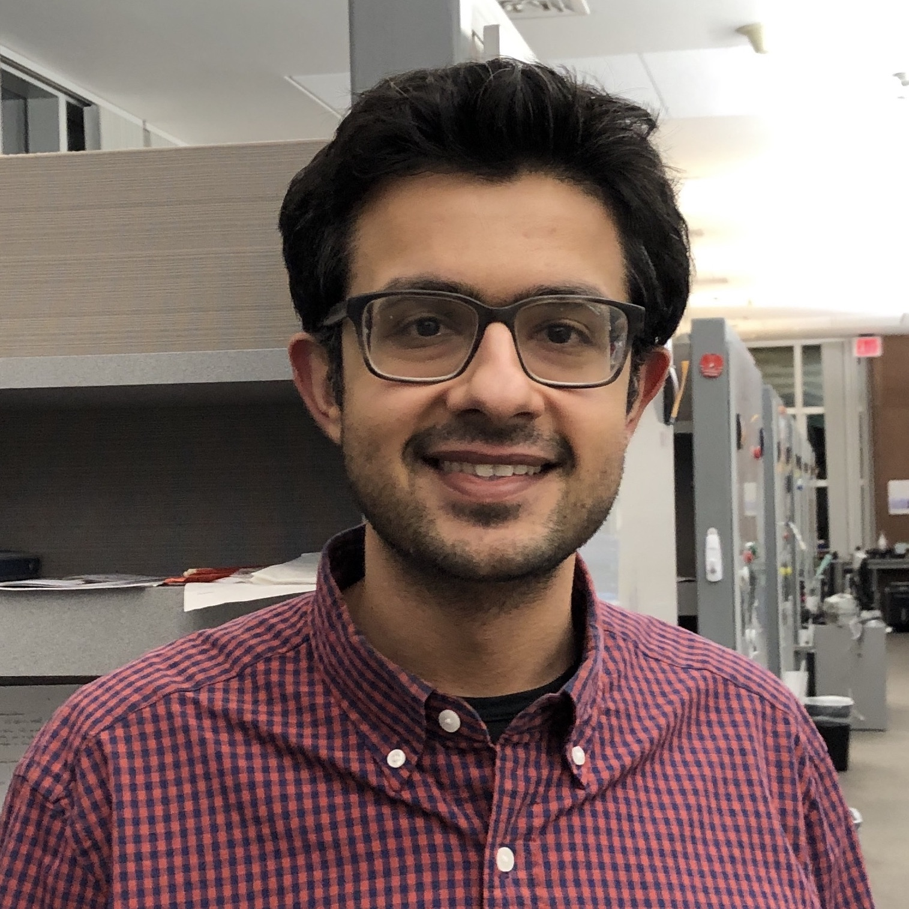
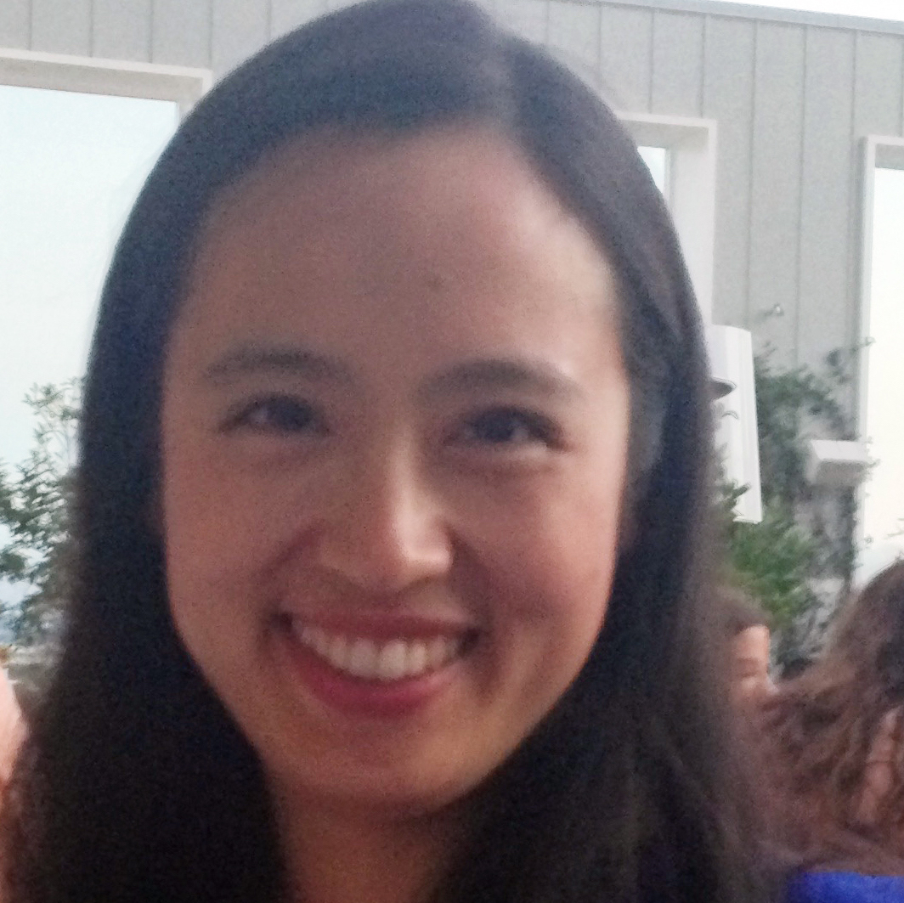
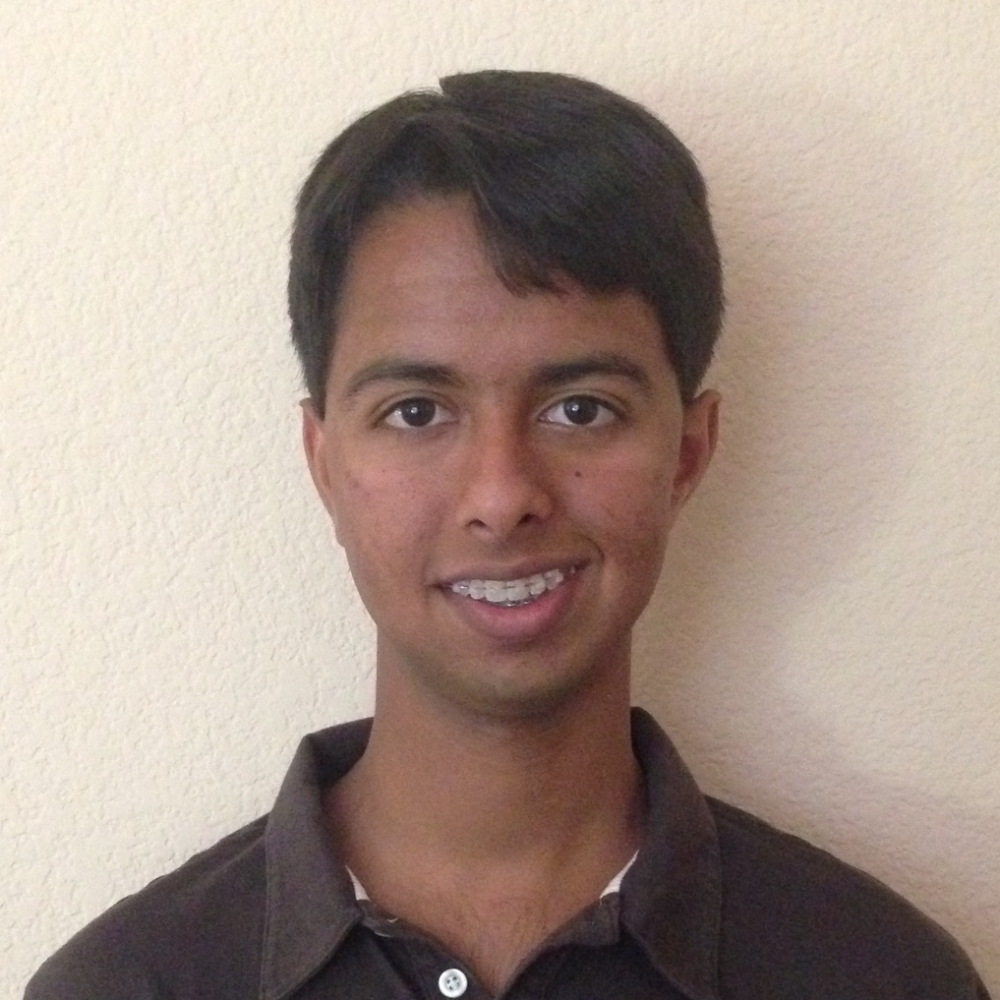



&nbsp;&nbsp;&nbsp;<b>Jason D. Buenrostro, PhD</b> 
&nbsp;&nbsp;&nbsp;Assistant Professor 
&nbsp;&nbsp;&nbsp;Harvard University 
&nbsp;&nbsp;&nbsp;[Stem Cell and Regenerative Biology](https://hscrb.harvard.edu/) 
&nbsp;&nbsp;&nbsp;[Allen Distinguished Investigator](https://alleninstitute.org/what-we-do/frontiers-group/distinguished-investigators/) 
&nbsp;&nbsp;&nbsp;Twitter: [@jd_buenrostro](https://twitter.com/jd_buenrostro) 
&nbsp;&nbsp;&nbsp;<a href="mailto:jason_buenrostro@harvard.edu">Contact

<b>Postdoctoral Fellows</b> 

&nbsp;&nbsp;&nbsp;<b>Salman Banani, MD PhD</b> 
&nbsp;&nbsp;&nbsp;Postdoctoral Fellow 
&nbsp;&nbsp;&nbsp; 
   

&nbsp;&nbsp;&nbsp;<b>Fabiana Duarte, PhD</b> 
&nbsp;&nbsp;&nbsp;Postdoctoral Fellow 
&nbsp;&nbsp;&nbsp; 
   

&nbsp;&nbsp;&nbsp;<b>Vinay Kartha, PhD</b> 
&nbsp;&nbsp;&nbsp;Postdoctoral Fellow 
&nbsp;&nbsp;&nbsp; 
   

&nbsp;&nbsp;&nbsp;<b>Lindsay LaFave, PhD</b> 
&nbsp;&nbsp;&nbsp;Postdoctoral Fellow 
&nbsp;&nbsp;&nbsp;Joint with Tyler Jacks Lab 
   

&nbsp;&nbsp;&nbsp;<b>Sai Ma, PhD</b> 
&nbsp;&nbsp;&nbsp;Postdoctoral Fellow 
&nbsp;&nbsp;&nbsp;Joint with Aviv Regev Lab 
   

&nbsp;&nbsp;&nbsp;<b>Tongtong Zhao, PhD</b> 
&nbsp;&nbsp;&nbsp;Postdoctoral Fellow 
&nbsp;&nbsp;&nbsp;Joint with Fei Chen Lab 
   

<b>Graduate Students</b> 

&nbsp;&nbsp;&nbsp;<b>Luolan Bai</b> 
&nbsp;&nbsp;&nbsp;Rotating Graduate Student 
&nbsp;&nbsp;&nbsp; 
&nbsp;&nbsp;&nbsp; 
  

&nbsp;&nbsp;&nbsp;<b>Zack Chiang, BS</b> 
&nbsp;&nbsp;&nbsp;Graduate Student 
&nbsp;&nbsp;&nbsp; 
&nbsp;&nbsp;&nbsp; 
  

&nbsp;&nbsp;&nbsp;<b>Mollie Driller-Colangelo</b> 
&nbsp;&nbsp;&nbsp;Rotating Graduate Student 
&nbsp;&nbsp;&nbsp; 
&nbsp;&nbsp;&nbsp; 
  

&nbsp;&nbsp;&nbsp;<b>Andrew Earl</b> 
&nbsp;&nbsp;&nbsp;Rotating Graduate Student 
&nbsp;&nbsp;&nbsp; 
&nbsp;&nbsp;&nbsp; 
  

&nbsp;&nbsp;&nbsp;<b>Caleb Lareau, MA</b> 
&nbsp;&nbsp;&nbsp;Collaborating Graduate Student 
&nbsp;&nbsp;&nbsp;Vijay Sankaran Lab 
&nbsp;&nbsp;&nbsp; 
  

&nbsp;&nbsp;&nbsp;<b>Julian Segert</b> 
&nbsp;&nbsp;&nbsp;Rotating Graduate Student 
&nbsp;&nbsp;&nbsp; 
&nbsp;&nbsp;&nbsp; 
  

&nbsp;&nbsp;&nbsp;<b>Tristan Tay</b> 
&nbsp;&nbsp;&nbsp;Graduate Student 
&nbsp;&nbsp;&nbsp; 
&nbsp;&nbsp;&nbsp; 
  

<b>Research Assistants</b> 

&nbsp;&nbsp;&nbsp;<b>Alison Brack, BS</b> 
&nbsp;&nbsp;&nbsp;Research Assistant 
&nbsp;&nbsp;&nbsp; 
&nbsp;&nbsp;&nbsp; 
  

<b>Undergraduate Students</b> 

&nbsp;&nbsp;&nbsp;<b>Max Bahdanovich</b> 
&nbsp;&nbsp;&nbsp;Undergraduate Research Fellow 
&nbsp;&nbsp;&nbsp;Harvard University 
   

&nbsp;&nbsp;&nbsp;<b>Venkat Sankar</b> 
&nbsp;&nbsp;&nbsp;Undergraduate Research Fellow 
&nbsp;&nbsp;&nbsp;Massachusetts Institute of Technology (MIT) 
   

<b>Administrative Support Staff</b> 

&nbsp;&nbsp;&nbsp;<b>Kevin Harrington</b> 
&nbsp;&nbsp;&nbsp;Faculty Assistant 
&nbsp;&nbsp;&nbsp;[Contact](https://hscrb.harvard.edu/people/kevin-harrington) 
   
